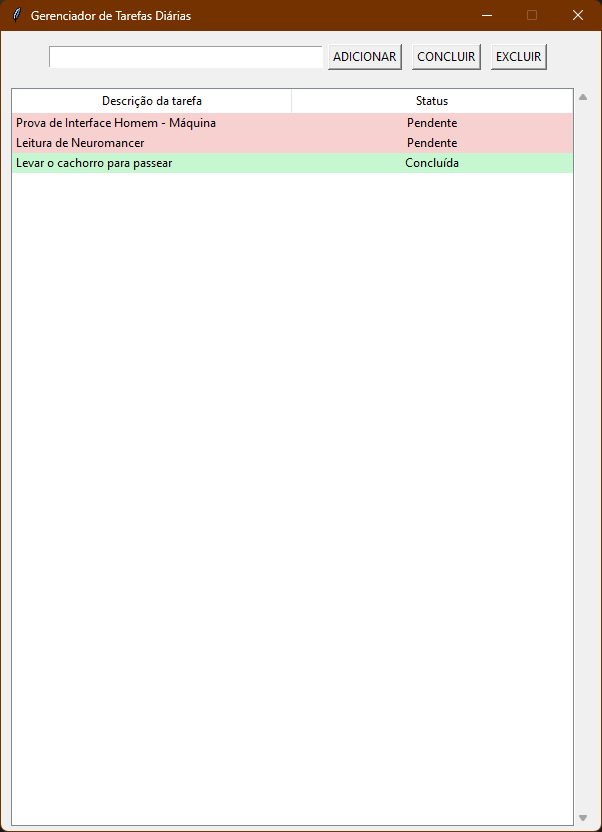

---

# 🗒️ Gerenciador de Tarefas com Interface Gráfica em Python


Uma aplicação de gerenciamento de tarefas de desktop, desenvolvida com Python, Tkinter e persistência de dados em JSON.
Este projeto foi criado para praticar **programação orientada a objetos**, **manipulação de arquivos** e **interfaces gráficas** com Tkinter.

---

## ✨ Funcionalidades

* **Adicionar Tarefas:** Campo de entrada para criar novas tarefas com descrição personalizada.
* **Listagem de Tarefas:** Exibe todas as tarefas em uma tabela (`Treeview`) com colunas para **descrição** e **status**.
* **Marcar como Concluída:** Botão para alterar o status de uma tarefa para "Concluída".
* **Excluir Tarefas:** Botão para remover a tarefa selecionada da lista e do arquivo.
* **Prevenção de Duplicadas:** Bloqueia a inserção de tarefas com descrição repetida.
* **Feedback Visual:** Tarefas pendentes aparecem em vermelho claro e concluídas em verde claro.
* **Persistência de Dados:** As tarefas são salvas em um arquivo JSON, garantindo que sejam carregadas novamente ao abrir o programa.

---

## 🛠️ Conceitos e Tecnologias Aplicadas

* **Python 3**
* **Tkinter:** Biblioteca padrão para criação de interfaces gráficas no Python.
* **ttk.Treeview:** Widget para exibição de dados em formato de tabela com múltiplas colunas.
* **pathlib:** Manipulação de caminhos de arquivo de forma mais legível e moderna.
* **JSON:** Formato para salvar e carregar as tarefas.
* **Programação Orientada a Objetos:** Estrutura baseada em uma classe `GerenciadorDeTarefa` para encapsular a lógica.

---

### 📸 Captura de Tela da Aplicação



---

## 🚀 Como Executar

1. **Clone o repositório:**

   ```bash
   git clone https://github.com/MatheusRuasVieira/gerenciador_de_tarefas_diarias_python.git
   ```

2. **Navegue até a pasta do projeto:**

   ```bash
   cd gerenciador_de_tarefas_diarias_python
   ```

3. **Execute o script:**

   ```bash
   python main.py
   ```

A janela do Gerenciador de Tarefas será aberta e você poderá começar a adicionar suas atividades.

---

## 📄 Licença

Este projeto está sob a licença MIT. Veja o arquivo [LICENSE](LICENSE) para mais detalhes.
